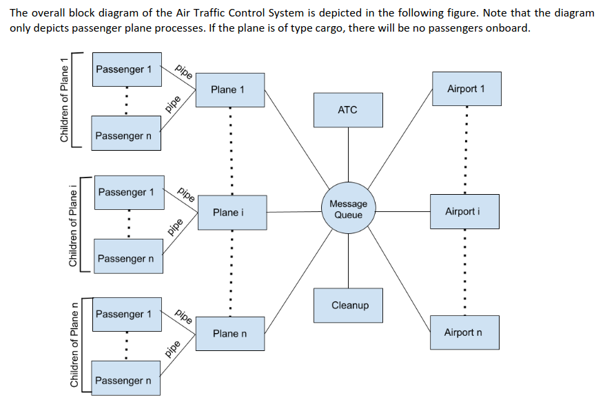

# OS-Assignment-2
## AIR TRAFFIC CONTROL SYSTEM

---




## Instructions for Running:
1. Create 6 terminals:
    1. 2 planes
    2. 2 airports
    3. 1 ATC
    4. 1 Cleanup

    however, you can create any number of planes and airports you want.

2. Type the following commands in the terminal for the respective `.c` file:
    1. **plane.c** : 
    ``` 
        gcc plane.c -o plane
        ./plane
    ```
    2. **cleanup.c** :
    ``` 
        gcc cleanup.c -o cleanup
        ./cleanup
    ```
    3. **airtrafficcontroller.c** :
    ``` 
        gcc airtrafficcontroller.c -o atc
        ./atc
    ```
    4. **airport.c** :
    ```
        gcc airport.c -o airport -lpthread
        ./airport

    ```